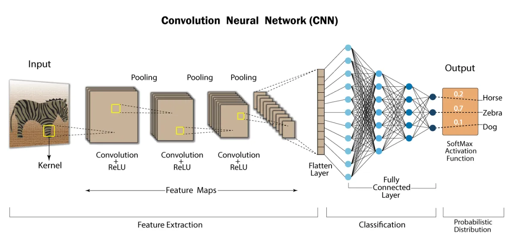
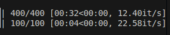
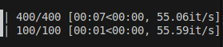
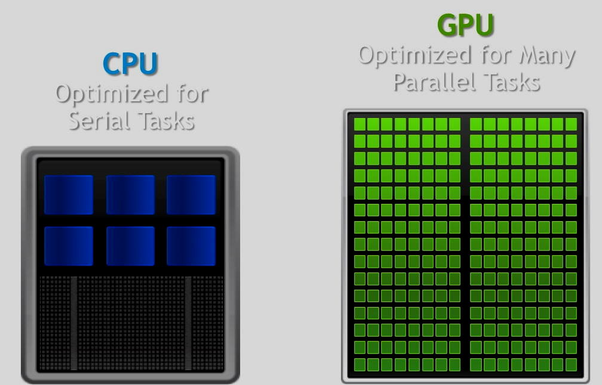
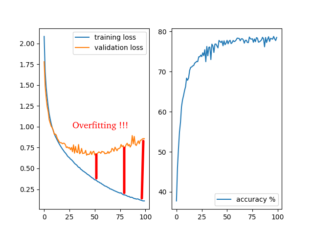
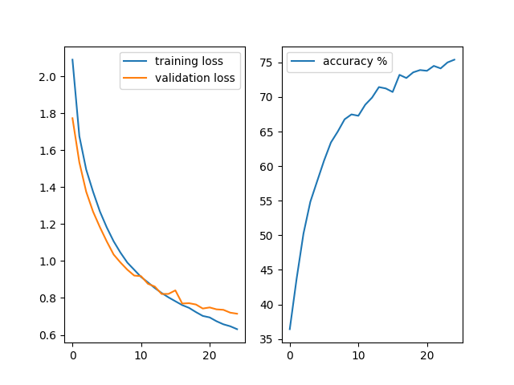
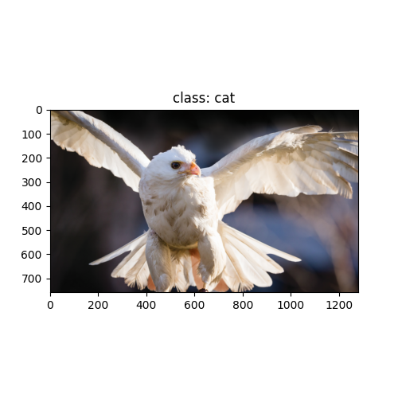
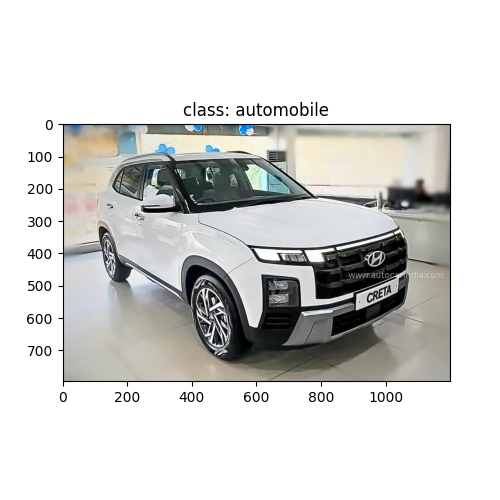
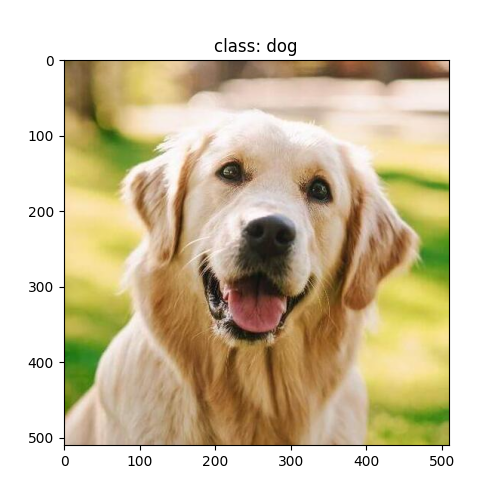
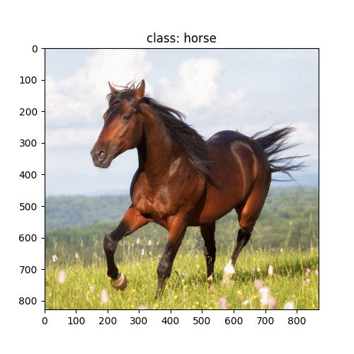

# CIFAR 10 - CNN  

This project implements a Convolutional Neural Network (CNN) using PyTorch to classify images from the CIFAR-10 dataset.

The main goal of the project is educational:

- Understand how **CNNs** work internally

- Learn the full training and inference pipeline

- Analyze **overfitting**

- Compare **CPU vs GPU performance**

- Build a solid foundation before moving to more complex architectures

The final model achieves approximately **80% accuracy** on the validation set.

---

## Dataset

The dataset used is **CIFAR-10**, which consists of **60,000 RGB images (32×32)** divided into 10 classes:

- airplane

- automobile

- bird

- cat

- deer

- dog

- frog

- horse

- ship

- truck

The dataset with train and test images (**>300k** images) is not included in this repository due to its size.

Dataset download link (Kaggle): https://www.kaggle.com/competitions/cifar-10/data

#### CIFAR-10 DATASET

    

---

## Model Architecture

The implemented model is a simple effective CNN, designed to clearly demonstrate the core building blocks of convolutional networks.

**Components**:

- 3 convolutional layers

- Batch Normalization after each convolution

- Max Pooling for spatial downsampling

- Fully connected layers

- Dropout for regularization

- ReLU activation

- Output layer with 10 classes

`Next images do not represent exactly de model architectura I've made, is a simple representation`: 

    

This architecture allows the network to learn hierarchical features, from simple edges in early layers to more complex object-level patterns in deeper layers.
The network uses 3×3 convolutional kernels, which are standard in many CNN architectures.

    

`A convolution applies a small kernel (e.g. 3×3) that slides across the image to extract local spatial patterns.
This operation generates feature maps that highlight important structures such as edges, textures, and shapes.`

---

## Training Performance: CPU vs GPU

Training time for **1 epoch (training + validation)** was compared using:

- **CPU**: Intel i7 (10th Gen)

- **GPU**: NVIDIA GTX 1650 Ti (Laptop)

| Device | Time per epoch | Batch Size |
| ------ | -------------- | ---------- |
| CPU    | ~36 seconds    |     200    |
| GPU    | ~8 seconds     |     200    |

    
     

In another repo project using **MNIST** https://github.com/AlejandroFontesAlbeza/nnMNISTPytorch with a simple **fully connected network (MLP)**, the training speed difference between CPU and GPU was negligible.

However, for this project:

- Convolutional layers involve a **large** number of matrix operations

- GPUs are optimized for **massively parallel computation**

- Even a relatively simple CNN benefits significantly from GPU acceleration

This project clearly shows **when and why GPU training becomes worthwhile:**

    

#### Training Analysis and Overfitting

**- Initial training**

The model was first trained for **100 epochs** to observe learning behavior.

From approximately epoch 30:

- Validation accuracy stops improving

- Validation loss stagnates or increases

- Signs of overfitting appear

    

**- Optimized training: 25 epochs**

Based on this observation, the model was retrained for **25 epochs.**

- Similar or better performance
- Reduced training time
- More efficient use of resources

    

---

## Inference

The `inference.py` script performs predictions on external images stored in the inputs directory.

During the inference de arquitecture and the weights of the model are loaded, the images are preprocessed for the model and the class predicted is displayed as the image:

    
    
    
    

As the accuracy of the training was a **~80%** we can see that 3 out of the 4 images are correctly classified but the bird image is classified as a cat.

---

## Conclusions

This project demonstrates that even a relatively simple convolutional architecture can achieve solid performance on **CIFAR-10**, reaching approximately **80%** validation accuracy when trained efficiently and with proper regularization. By analyzing the training curves, it became clear that extending training beyond **~25–30 epochs** led to diminishing returns and signs of overfitting, reinforcing the importance of monitoring validation metrics rather than blindly increasing training time.

From an architectural perspective, this model sits in an important middle ground: it is significantly more powerful than a **fully connected network** (such as those commonly used for *MNIST*), yet far simpler than modern state-of-the-art architectures like **ResNet** or **EfficientNet**. This makes it especially valuable as a learning tool, since all core CNN components—convolutions, pooling, batch normalization, dropout, and fully connected layers—are explicitly visible and easy to reason about.

The project also highlights a key practical insight: **GPU acceleration** becomes truly beneficial once convolutional operations are introduced. While linear models show little difference between **CPU** and **GPU** training times, convolutional networks benefit greatly from the parallelism offered by **GPUs**, even on consumer-grade hardware.

*There are many possible directions for improvement. On the modeling side, deeper architectures, residual connections, or global average pooling could be explored. On the training side, data augmentation, learning rate scheduling, early stopping, and more advanced regularization techniques could further improve generalization. Evaluation could also be expanded with confusion matrices or per-class metrics to better understand model behavior.*

Overall, this project serves as a strong foundation for more advanced computer vision tasks. It bridges the gap between simple classification models and modern deep learning systems, providing both practical experience and conceptual understanding that can be directly transferred to more complex architectures and real-world applications.

---

## References

- **NeuralNine** - *Clasificación de imágenes CNN en Pytorch*: https://www.youtube.com/watch?v=CtzfbUwrYGI&t=1662s
- **Devoxx** - *Tensorflow and deep learning - without a PhD by Martin Görner*: https://www.youtube.com/watch?v=vq2nnJ4g6N0&t=5354s
- W**ill Cukierski. CIFAR-10** - *Object Recognition in Images*. https://kaggle.com/competitions/cifar-10, 2013. **Kaggle**.